## Microsoft Sentinel Training Lab
This project would be a walkthrough on how to setup the Microsoft Sentinel workspace and analyze ingested data.

### A. Choose a subscription (Azure for student or trial 31 days)
Go to Microsoft Sentinel, create a workspace by enter resource group and instance name.

**Note:** You need to search Microsoft Sentinel and manually add it to a workspace after creation for the deployment to be successful.
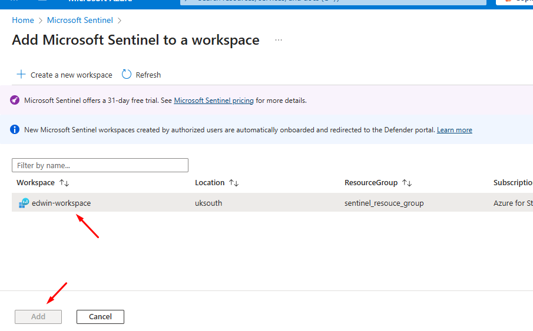

### B. Microsoft Sentinel Training Lab Solutions
Go to search bar, look for Microsoft Sentinel Training Lab Solutions, which should have some sample logs, etc to train with. Create with the current workspace.
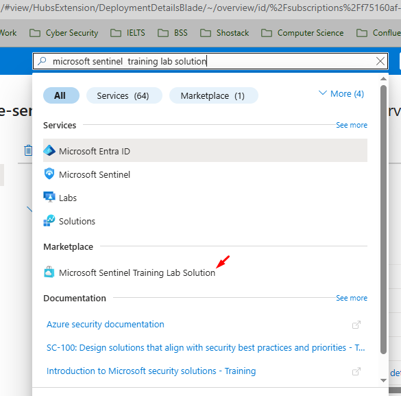

Once deployed, it should be like so (When go to Microsoft Sentinel and choose the instance/workspace we just deployed):
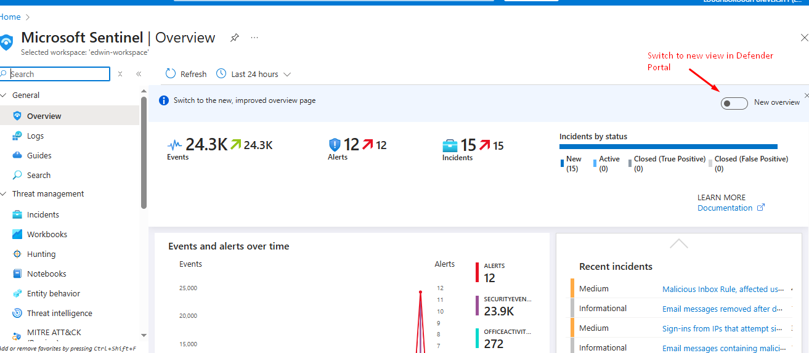

**Test data:** : Microsoft Sentinel Training Lab Solutions

#### New view:
The new Microsoft Sentinel is now in Defender Portal:
https://security.microsoft.com/
Go to the page and reload a few time so the Sentinel related tabs are displayed.
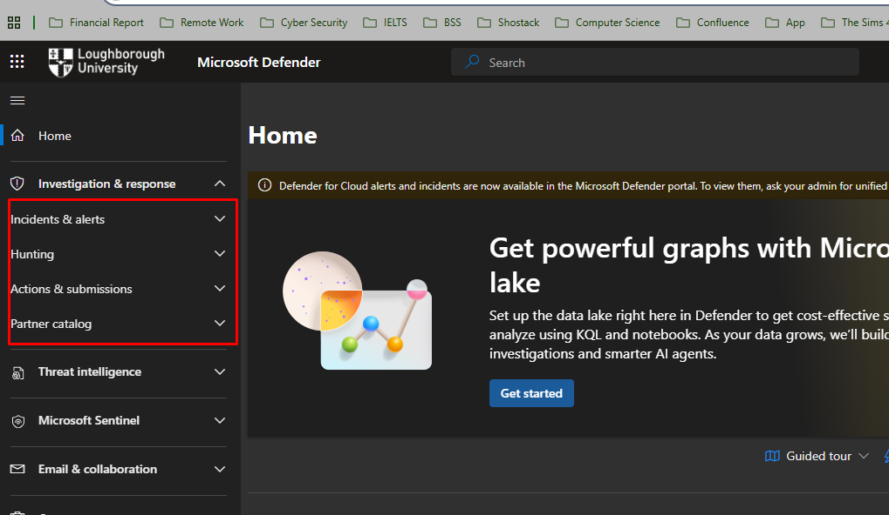
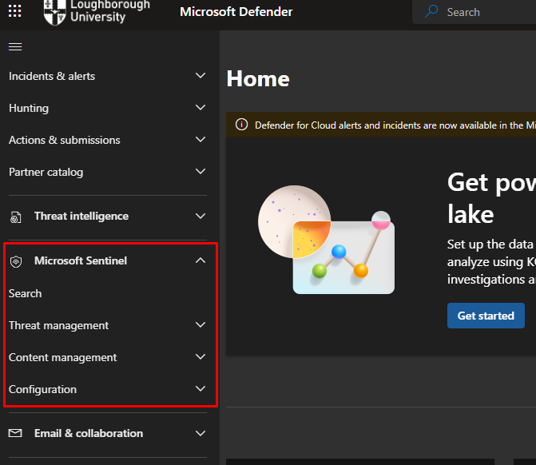

### C. Investigating incidents
We could investigating security incidents, view in full details, check the tactics & techniques from ATTK&CK
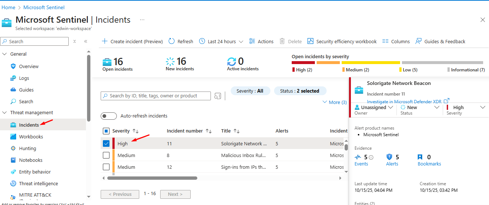

### D. Setup Playbook
To ensure that we have playbook setup for the training lab, go to resource group, choose the API Connection azuresentinel-Get-GeoFromIpAndTagIncident, then 
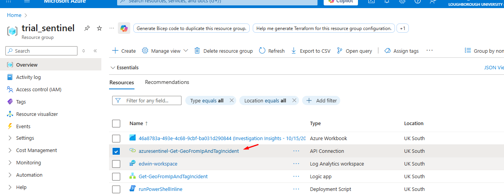
Then edit the API connection => Authorized.
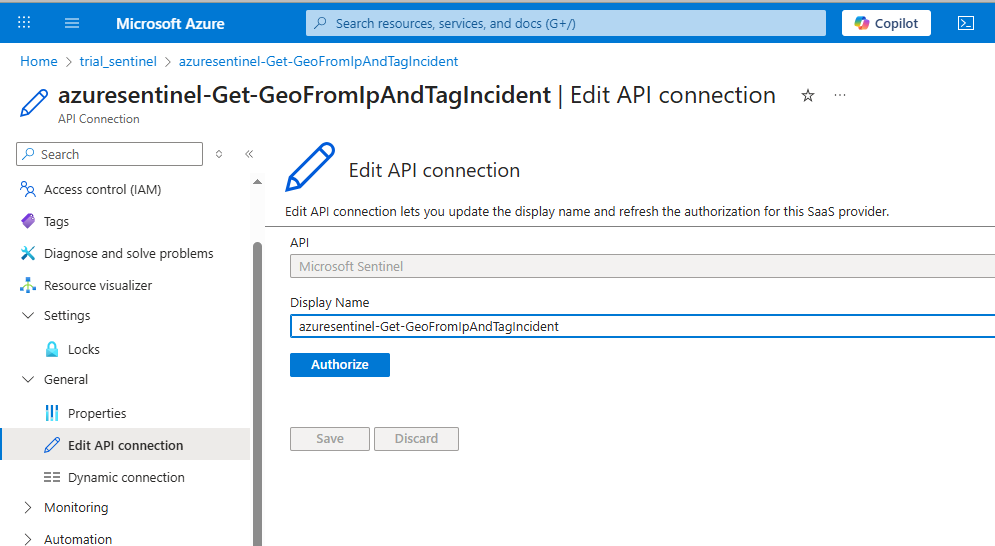

### E. Ingest data from data connectors
The data connectors are found under Content Hub:
For Sentinel view:
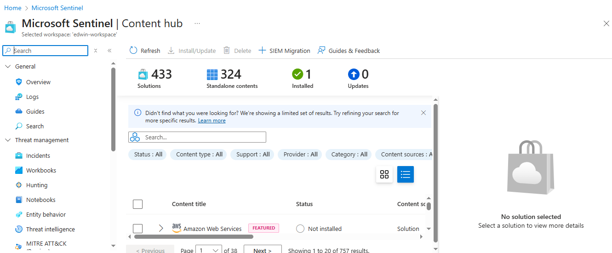
For Defender view:
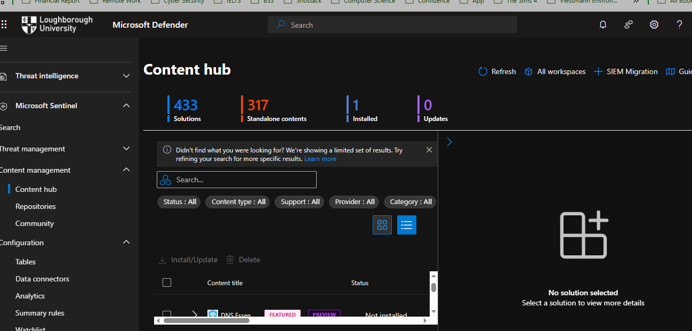

Within solution, you can see more things:
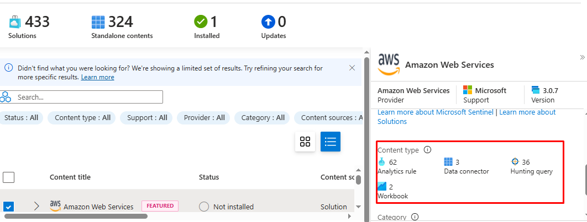

Free data sources for Microsoft 365 Sentinel users:
Azure Activity Logs
Office 365 Audit Logs (all SharePoint activity and Exchange admin activity)
Alerts from Microsoft Defender for Cloud, Microsoft Defender XDR, Microsoft Defender for Office 365, Microsoft Defender for Identity, Microsoft Defender for Endpoint, and Microsoft Defender for Cloud Apps.

Details: https://azure.microsoft.com/en-gb/pricing/offers/sentinel-microsoft-365-offer

Depends on what you need for your specific environment, you can install the data connectors and configs the rules accordingly.

### F. Search for a list of certain alerts, etc. (Similar to SQL) (Hunting)
Can send in query using KQL
Testing cluster free to train KQL skills:
https://dataexplorer.azure.com/publicfreecluster
